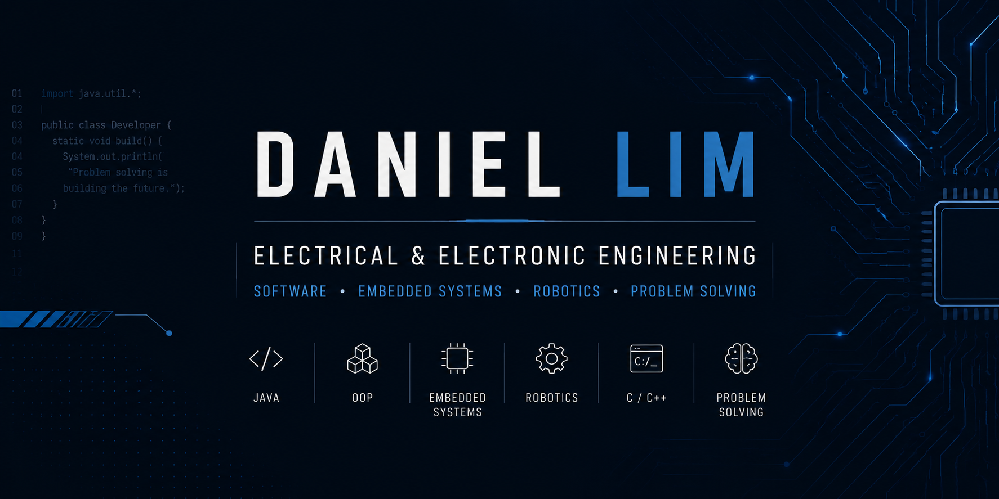

  

# Hi, I'm Daniel 👋

MEng Electrical and Electronic Engineering student at the University of Manchester, interested in software development, embedded systems, and robotics.

## About Me

I build projects that develop my problem-solving and software-design skills. I currently work primarily with Java and am expanding into C/C++, embedded systems, and robotics.

## Technical Skills

**Languages:** Java, C/C++  
**Software development:** Object-oriented programming, data structures and collections, file I/O, debugging, software design  
**Areas of interest:** Embedded systems, robotics, control systems

## Currently Exploring

- C/C++ for robotics and embedded development
- Embedded systems and hardware-software integration
- Robotics and autonomous control systems

## Featured Projects

### 🎮 [Tower Defence Game](https://github.com/danielcmlim/CP12-TowerDefenceGame)
**Java · LibGDX · Object-oriented design**

Built a tower-defence game featuring multiple enemy types, weapons, upgrades, companions, and strategic gameplay systems.

### 🎮 [Elemental Platformer](https://github.com/danielcmlim/Elemental-Platformer)
**Java · Physics-based gameplay · Level design**

Developed a physics-based platformer centred on player movement, environmental hazards, and level design.

### 👾 [Monster OOP Project](https://github.com/danielcmlim/Monster-OOP-Project)
**Java · Inheritance · Polymorphism**

Created a console-based Java project that applies object-oriented programming through an abstract `Monster` class and multiple specialised monster types.

### 🤖 [886U VEX High Stakes](https://github.com/danielcmlim/886U-VEX-High-Stakes)
**C/C++ · VEX Robotics · Autonomous control**

Developed competition robot code for VEX Robotics High Stakes, covering autonomous routines, driver control, and robot mechanisms.

## Connect

[LinkedIn](https://www.linkedin.com/in/danielcmlim/) · [Email](mailto:danielcmlim1@gmail.com)
